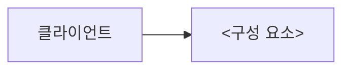

# <기술명> — 아키텍처

> ⚠️ **템플릿 지침 (완성 후 이 블록을 지울 것)**
> 목표는 **"요청/데이터 하나가 어디를 어떤 순서로 지나는가"** 를 끝까지 따라가는 것이다.
> 근거가 공식 문서인지 소스 코드인지 밝히고, 버전을 명시한다. 확인 못 한 구간은 "확인 필요"로 남긴다.

**기준 버전**: <>

## 구성 요소

| 요소 | 역할 | 상태를 갖는가 |
| --- | --- | --- |
| | | |

## 데이터가 흐르는 경로

<단계별로 무슨 일이 일어나는지 번호를 붙여 서술한다.>

1.
2.

## 상태는 어디에 저장되는가

<메모리/디스크/외부 저장소. 장애가 나면 무엇이 사라지는지까지.>

## 장애가 나면 어떻게 되는가

| 무엇이 죽으면 | 어떻게 되는가 | 복구 방식 |
| --- | --- | --- |
| | | |

---

*작성일: YYYY-MM-DD*
